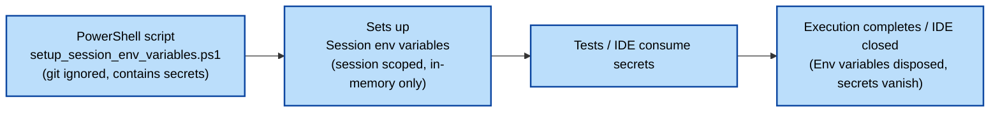

# Verify Environments
*(A production-grade, Automated Login Verification Tool built in Python)*

---

## 🎯 Purpose
The goal of this project is to eliminate repetitive and time-consuming manual checks and ensure that logins across all
test environments remain healthy and functional at all times.

---

## 🧩 Overview
This project automates the verification of login functionality across four environments: dev, dev-int, test, and
staging.\
Each environment is validated against five types of logins:
1. UI SSO login with TOTP verification
2. UI External user login with OTP verification
3. Server SFTP (password-based) login
4. Server SFTP (SSH key-based) login
5. Server FTPS login

---

## 🚀 Key Features
1. Flixible configuration with utmost importance to safeguarding secrets
2. Automated execution via a single double-clickable PowerShell script
3. Setup env variables and IDE for local debug sessions via a single double-clickable PowerShell script
4. Automated TOTP retrieval for SSO login
5. Automated OTP retrieval from Gmail for external user login
6. Automated Server logins SFTP and FTPS connections
7. Automated HTML report generation with failure screenshots
8. Automated email reporting with intuative and informative summary + HTML report attached
9. CI/CD ready via GitHub workflows and a single PowerShell script

---

## 🛠️ Initial Setup
### **Step 1: Install Python and IDE**
- Install the latest Python version (example: **Python 3.14**).
- Add Python and Scripts paths to your system environment variable - Path:
    - Python path: `C:\Program Files\Python314`
    - Scripts path: `C:\Program Files\Python314\Scripts`
- Install your preferred IDE (PyCharm recommended).  
  If using PyCharm, choose **virtual environment (venv)** — this keeps all dependencies isolated inside the `.venv`
  folder.

### **Step 2: Clone the Repository**
Clone the repo locally using Git commands or your IDE.  
(Using an IDE is generally more user-friendly.)

### **Step 3: Install Project Requirements**
- Open a **Cmd / PowerShell** prompt and navigate to `ProjectRoot`.  
  (IDE terminal can also be used.)
- Run:
  ```bash
  pip install -r requirements.txt
  ```
- This installs all dependencies inside the `.venv` folder.

### **Step 4: Set Up Project Secrets Locally**
- Navigate to `ProjectRoot/configs` in File explorer.
- Create a copy of `sample.setup_session_env_variables.ps1` and rename it to:
  ```
  setup_session_env_variables.ps1
  ```
- This file is **git-ignored**, so it is safe to assign **secret and non-secret values** here. Make sure **all variables** are assigned.
  
- This script creates **session environment variables** which are required for local debugging and running tests.
- 🔍 Quick concept: Session vs User Environment Variables
  **Session variables** → Only available to the current terminal/IDE session (**more secure**)
  **User variables** → Persist for the logged-in user across the system

### **Step 5: Configure Local Debugging**
- Open `ProjectRoot/VerifyEnvironments.debug.ps1` and configure the necessary parameters for your IDE:
  
- Create a desktop shortcut for **VerifyEnvironments.debug.ps1**.
- Close your IDE (save changes).
- Run the shortcut — this will:
    - Create session-level environment variables
    - Open your IDE with correct access to those variables
- 👉 **Always open your IDE using this debug script** so that debugging and IDE test execution have access to the required 
  env variables.

### **Step 6: Run Tests Locally independent of IDE**
- Configure the Python executable path in:
  ```
  ProjectRoot/VerifyEnvironments.run.ps1
  ```
  
- Create a desktop shortcut for **VerifyEnvironments.run.ps1**.
- Running this shortcut will:
    - Create session-level environment variables
    - Execute all tests with correct access to those variables
    - Email the report to the recipients configured in `setup_session_env_variables.ps1`
    - Save all artifacts (HTML + JSON reports) under `ProjectRoot/reports`
- 👉 The run script does *not* use the debug session variables from Step 5. It creates its own temporary session environment 
  variables, and cleans them up after execution.
- 📊 Email report includes:
  - A quick summary of Total, Passed, Failed, and Rerun tests 
  - A clear, tabular breakdown of results per environment 
  - The HTML test report attached for detailed review
- 📊 HTML report provides:
  - A full list of all executed tests, with filters to show only Passed, Failed, or Rerun tests
  - Expandable sections for each test containing logs, warnings, errors, and exceptions
  - Screenshots for failed Selenium-based UI tests to assist with troubleshooting

- Email report examples:
  


- HTML report examples:
  


### **Step 7: CI/CD Integration**
- Add all required project environment variables (**secret + non-secret**) to the **GitHub Secrets Store**.
- A draft workflow is available with options to run every 6 hours and manual trigger.
  ```
  .github/workflows/verify-environments.yml
  ```
- This workflow triggers:
  ```
  VerifyEnvironments.pipeline.ps1
  ```
  to run tests in CI and send the email report.

---

## 📂 Framework structure and explanation
```
VerifyEnvironments/
├── config/
│   └── config.py          # Clean configuration (no secrets)
│
├── reports/
│   ├── report.py          # Generates verification reports
│
├── utils/
│   ├── env_loader.py      # Secure environment variable handling
│   ├── logger.py          # Central logging utilities
│
├── verifiers/
│   ├── base_verifier.py   # Template Method implementation
│   ├── ui_verifier.py     # UI login verifications
│   ├── server_verifier.py # API backend verifications
│
├── main.py                # Orchestrates the entire workflow
├── README.md
└── requirements.txt
```

---

## 🔐 Secrets Flow


---

## 🧠 Design patterns used (towards geeky side)
### 1. **Template Method Pattern**
The core verification workflow (setup → perform check → teardown → report) follows the Template Method pattern.
**Why?**
- Ensures consistency for all verifiers.
- Reduces duplicate code.
- Allows each verifier to focus only on its specific check.

### 2. **Strategy Pattern** *(Optional layer for future)*
If you plug in new environment types (e.g., mobile verifier, DB connection verifier), they can be dynamically selected.

### 3. **Factory Pattern** *(Internal use in main runner)*
To instantiate the correct verifier based on the environment.

### 4. **Separation of Concerns** + **Single Responsibility Principle**
Each component is small, focused, independent, and reusable.

---

## 🎯 Why This Project Matters
- Solves a **real production problem**.
- Demonstrates understanding of **design patterns**, **modular architecture**, and **automation**.
- Is **pipeline‑ready** for CI/CD.
- Uses **clean code practices**.
- Shows capability to design end‑to‑end systems.
It’s not just a script — it’s a **mini production framework**.

---

## 🤝 Contributing
Open for enhancements.

---

## 📄 License
MIT License.
