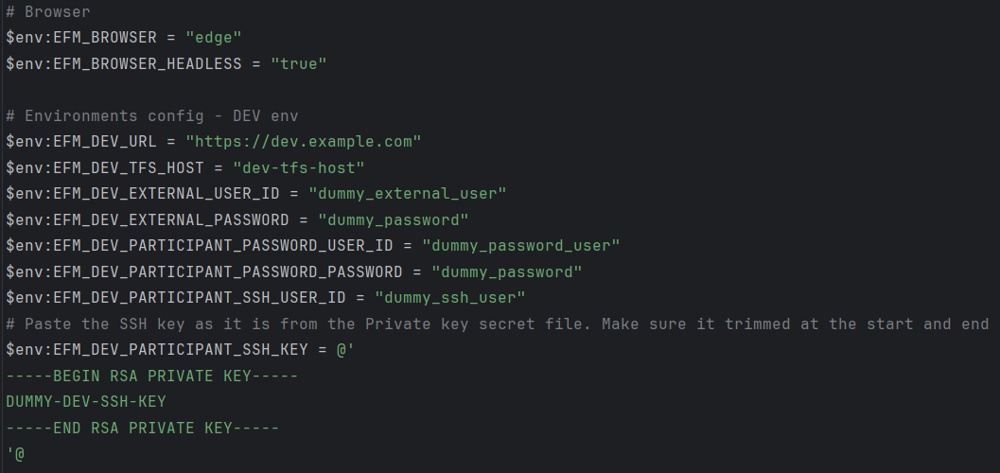
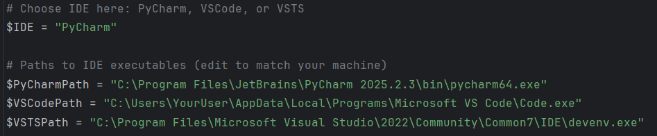
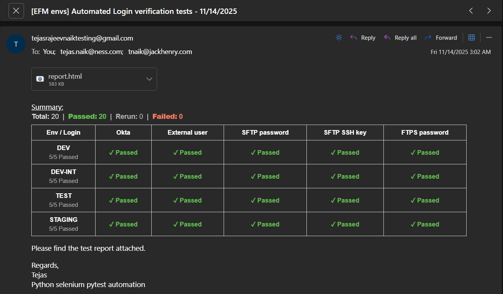
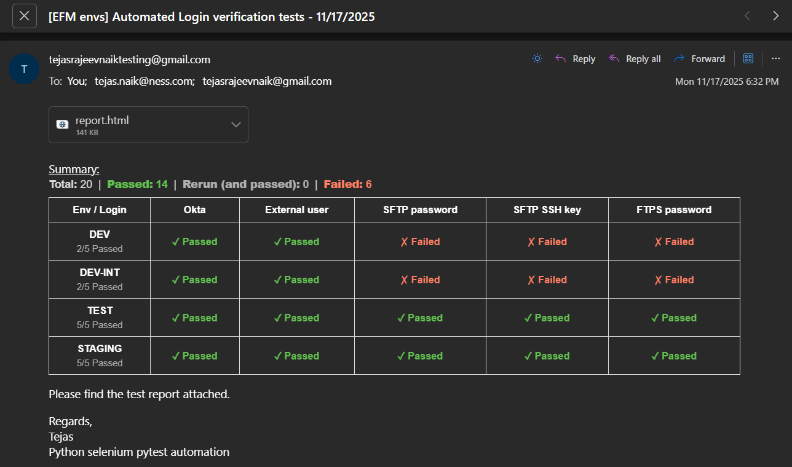
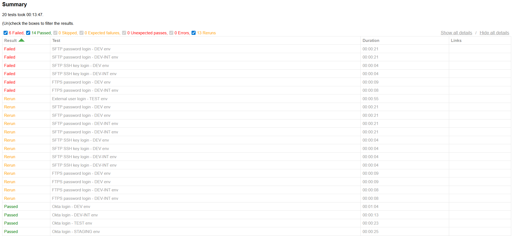
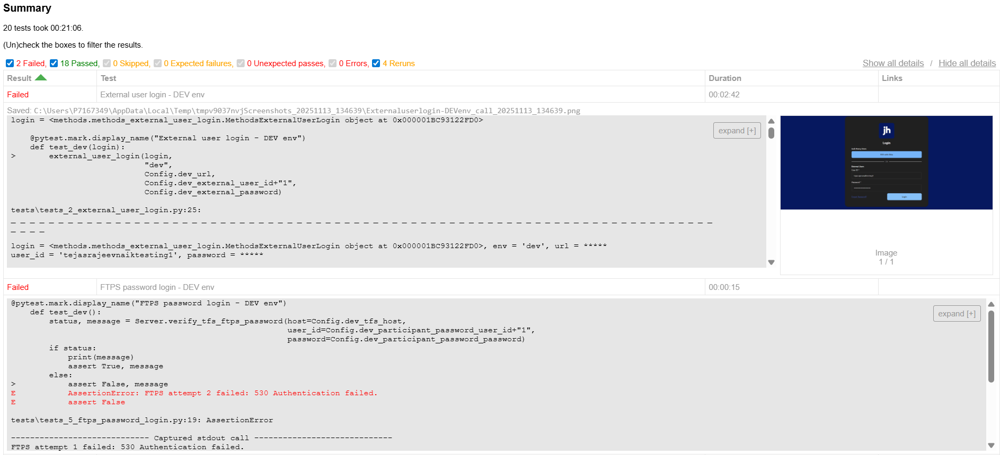
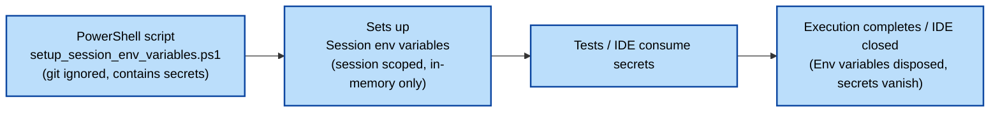

[](https://creativecommons.org/licenses/by-nc/4.0/)


# Verify Environments

*(An automated Login Verification Tool built in Python)*

## 🎯 Purpose

The goal of this project is to eliminate repetitive and time-consuming manual checks and ensure that logins across all
test environments remain healthy and functional at all times.

## 🧩 Overview

This project automates the verification of login functionality across four environments: dev, dev-int, test, and
staging.\
Each environment is validated against five types of logins:

- UI SSO login with TOTP verification
- UI External user login with OTP verification
- Server SFTP (password-based) login
- Server SFTP (SSH key-based) login
- Server FTPS login

## 🚀 Key Features

- Flixible configuration with utmost importance to safeguarding secrets
- Automated execution via a single double-clickable PowerShell script
- Setup env variables and IDE for local debug sessions via a single double-clickable PowerShell script
- Automated TOTP retrieval for SSO login
- Automated OTP retrieval from Gmail for external user login
- Automated Server logins SFTP and FTPS connections
- Automated HTML report generation with failure screenshots
- Automated email reporting with intuative and informative summary + HTML report attached
- CI/CD ready via GitHub workflows and a single PowerShell script

## 📘 Learnings

- 💪 Personal Growth
    - Identifying a genuine project problem — repetitive manual checks that were slow and error-prone
    - Visualizing the end-to-end solution and planning the approach (an exiting idea 💡)
    - Breaking the work into a detailed 3-week timeline with clear goals
    - Researching tricky issues and systematically solving them
    - Continuously improving code structure for better modularity and efficiency
    - Working outside office hours to complete the project faster and setting high expectations for myself
    - Satisfaction of solving a real project pain point and delivering a solid value-add


- 🧠 Technical Growth
    - Gained knowledge across the project tech stack: Python, unittest, pytest, Selenium, PowerShell, Batch scripting,
      paramiko, ssl, ftplib, smtplib, email, Git, and GitHub workflows YAML
    - Improved Selenium skills — identifying reliable locators and using headless browser automation
    - Gained confidence in automating complex login flows: SSO, TOTP/OTP, SFTP (password + SSH key) and FTPS
    - Built solid hands-on experience with secure secret management using temporary session-based environment variables
    - Learned to generate simple yet effective report using JSON output file
    - Gained confidence in designing reusable utilities, method layers, and clean Pytest tests
    - Improved architectural thinking with design patterns such as Factory, Page Object Model (POM), BDD-style
      structuring,
      and Template Method
    - Gained basic understanding of CI/CD workflows through GitHub Actions
    - ⭐ **Gained confidence in designing and delivering an end-to-end automation system independently**

## 🛠️ Initial Setup

### **Step 1: Install Python and IDE**

- Install the latest Python version (example: **Python 3.14**).
- Add Python and Scripts paths to your system environment variable - Path:
    - Python path: `C:\Program Files\Python314`
    - Scripts path: `C:\Program Files\Python314\Scripts`
- Install your preferred IDE (PyCharm recommended).  
  If using PyCharm, choose **virtual environment (venv)** — this keeps all dependencies isolated inside the `.venv`
  folder.

### **Step 2: Clone the Repository**

Clone the repo locally using Git commands or your IDE.  
(Using an IDE is generally more user-friendly.)

### **Step 3: Install Project Requirements**

- Open a **Cmd / PowerShell** prompt and navigate to `ProjectRoot`.  
  (IDE terminal can also be used.)
- Run:
  ```bash
  pip install -r requirements.txt
  ```
- This installs all dependencies inside the `.venv` folder.

### **Step 4: Set Up Project Secrets Locally**

- Navigate to `ProjectRoot/configs` in File explorer.
- Create a copy of `sample.setup_session_env_variables.ps1` and rename it to:
  ```
  setup_session_env_variables.ps1
  ```
- This file is **git-ignored**, so it is safe to assign **secret and non-secret values** here. Make sure **all variables
  ** are assigned.
  
- This script creates **session environment variables** which are required for local debugging and running tests.
- 🔍 Quick concept: Session vs User Environment Variables
  **Session variables** → Only available to the current terminal/IDE session (**more secure**)
  **User variables** → Persist for the logged-in user across the system

### **Step 5: Configure Local Debugging**

- Open `ProjectRoot/VerifyEnvironments.debug.ps1` and configure the necessary parameters for your IDE:
  
- Create a desktop shortcut for **VerifyEnvironments.debug.ps1**.
- Close your IDE (save changes).
- Run the shortcut — this will:
    - Create session-level environment variables
    - Open your IDE with correct access to those variables
- 👉 **Always open your IDE using this debug script** so that debugging and IDE test execution have access to the
  required
  env variables.

### **Step 6: Run Tests Locally independent of IDE**

- Configure the Python executable path in:
  ```
  ProjectRoot/VerifyEnvironments.run.ps1
  ```
  
- Create a desktop shortcut for **VerifyEnvironments.run.ps1**.
- Running this shortcut will:
    - Create session-level environment variables
    - Execute all tests with correct access to those variables
    - Email the report to the recipients configured in `setup_session_env_variables.ps1`
    - Save all artifacts (HTML + JSON reports) under `ProjectRoot/reports`
- 👉 The run script does *not* use the debug session variables from Step 5. It creates its own temporary session
  environment
  variables, and cleans them up after execution.
- 📩 Email report includes:
    - A quick summary of Total, Passed, Failed, and Rerun tests
    - A clear, tabular breakdown of results per environment
    - The HTML test report attached for detailed review
- 📩 Email report examples:
    
  
- 📊 HTML report provides:
    - A full list of all executed tests, with filters to show only Passed, Failed, or Rerun tests
    - Expandable sections for each test containing logs, warnings, errors, and exceptions
    - Screenshots for failed Selenium-based UI tests to assist with troubleshooting
- 📊 HTML report examples:
    
  

### **Step 7: CI/CD Integration**

- Add all required project environment variables (**secret + non-secret**) to the **GitHub Secrets Store**.
- A draft workflow is available with options to run every 6 hours and manual trigger.
  ```
  .github/workflows/verify-environments.yml
  ```
- This workflow triggers:
  ```
  VerifyEnvironments.pipeline.ps1
  ```
  to run tests in CI and send the email report.

## 📂 Framework Structure and Explanation

```
VerifyEnvironments/
├── configs/                                            # --- Centralized Configuration ---
│   ├── __init__.py                                     # Marks the folder as an importable package for the Project, IDE, and Pytest
│   ├── config.py                                       # Clean, frozen configuration values read from session environment variables (contains no secrets)
│   ├── setup_session_env_variables.ps1                 # Git-ignored PowerShell script that holds all secret + non-secret environment values for local runs
│   └── sample.setup_session_env_variables.ps1          # Safe checked-in sample file that illustrates required variable structure (contains no secrets)
│
├── utilities/                                          # --- Shared Utilities used across tests ---
│   ├── __init__.py                                     # Marks the folder as an importable package for the Project, IDE, and Pytest
│   ├── driver_factory.py                               # Central factory for opening browsers (Chrome/Edge), supporting headless or normal mode based on config
│   ├── logger.py                                       # Creates module-level loggers and provides a get_logger() helper
│   └── totp.py, otp.py, server.py                      # Independent utility modules offering static methods for TOTP generation, OTP retrieval, server interactions, etc
│
├── methods/                                            # --- Reusable action methods that tests call ---
│   ├── __init__.py                                     # Marks the folder as an importable package for the Project, IDE, and Pytest
│   ├── methods_base.py                                 # Base class providing common reusable methods shared by the tests
│   └── multiple method modules (.py)                   # Modular, behavior-driven method files containing functionality steps and Selenium locators
│
├── tests/                                              # --- Organized test suite ---
│   ├── __init__.py                                     # Marks the folder as an importable package for the Project, IDE, and Pytest
│   ├── conftest.py                                     # Primary Pytest configuration and execution entry / exit
│   ├── tests_1_okta_login.py                           # SSO login tests
│   ├── tests_2_external_user_login.py                  # External user login tests
│   ├── tests_3_sftp_password_login.py                  # Server SFTP (password-based) login tests
│   ├── tests_4_sftp_ssh_login.py                       # Server SFTP (SSH key-based) login tests
│   └── tests_5_ftps_password_login.py                  # Server FTPS (password-based) login tests
│
├── reports/                                            # --- Automated reporting system ---
│   ├── __init__.py                                     # Marks the folder as an importable package for the Project, IDE, and Pytest
│   ├── report.py                                       # Generates and sends report email
│   ├── report.html                                     # Detailed HTML output showing test results, logs, and screenshots
│   └── report.json                                     # Machine-readable version used internally for generating email summary
│
├── docs/                                               # --- Documentation assets ---
│   └── images/
│       └── documentation images                        # Contains all images referenced in the README.md file
│
├── .github/                                            # --- CI/CD automation ---
│   └── workflows/
│       └── verify-environments.yml                     # GitHub Actions workflow supporting scheduled and manual test execution
│
├── pytest.ini                                          # Central Pytest configuration (markers, test discovery, addopts)
├── requirements.txt                                    # Dependency packages for local installs and CI/CD runs
│
├── .gitattributes                                      # Used to influence GitHub’s Linguist so the project is recognized as a Python repository
├── .gitignore                                          # Ensures secrets, generated files, and environment folders are not committed
│
├── .pre-commit-config.yaml                             # Defines automated pre-commit checks (linting, security, formatting)
├── .flake8                                             # Central flake8 configuration for consistent code style (run: `flake8 .`)
├── .bandit                                             # Security scanner configuration for Python code (run: `bandit -r .`)
│
├── VerifyEnvironments.debug.ps1                        # Entry script for local debugging (creates session env vars + opens IDE)
├── VerifyEnvironments.run.ps1                          # Runs the entire suite locally and sends report
├── VerifyEnvironments.pipeline.ps1                     # Entrypoint for CI/CD tests execution
│
├── README.md                                           # Main project documentation and usage guide
├── CONTRIBUTING.md                                     # Guidelines for contributing to the project
│
└── LICENSE                                             # CC BY-NC 4.0 license (non-commercial use only)
```

## 🔐 Secrets Flow



## 🤝 Contributing

Contributions and enhancements are welcome.

## 📄 License

This project is licensed under the **Creative Commons Attribution–NonCommercial 4.0 International (CC BY-NC 4.0)** License.
